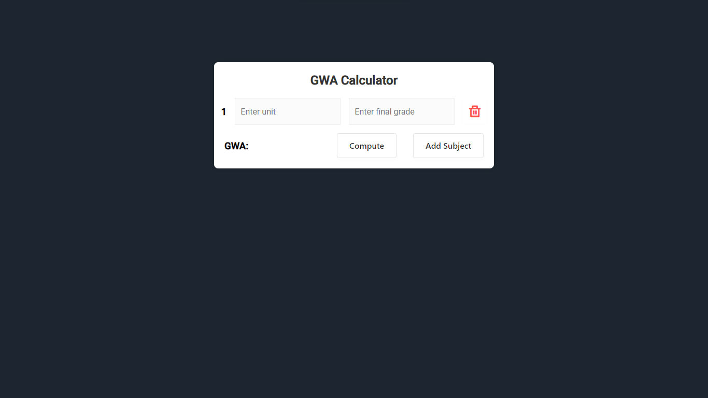

# Grade Weighted Average Calculator

A simple web-based Grade Weighted Average calculator implemented using HTML, CSS, and JavaScript.

## Features

- Calculate Grade Weighted Average (GWA) based on input grades and corresponding weights.
- Responsive design for various devices.

## Screenshots

